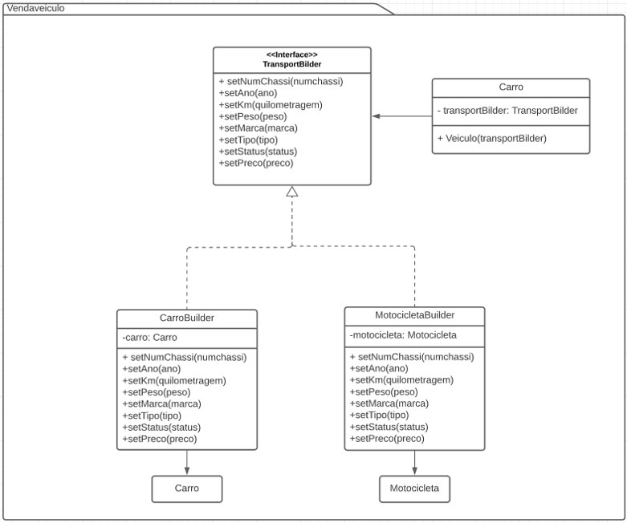
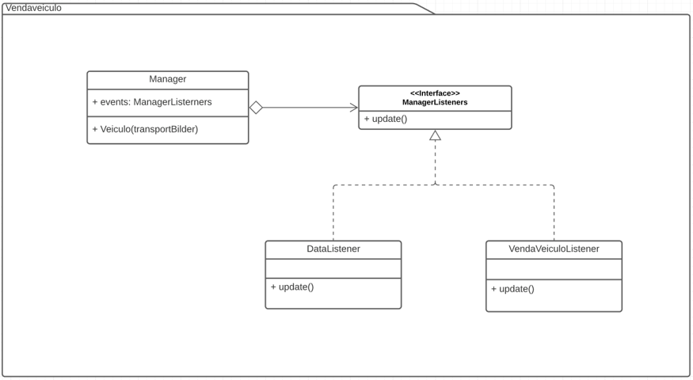

# VendaVeiculo
VendaVeiculo para POO

Fiz umas mudancinhas na main, acrescentei a exclusão de clientes e veículos, alterei a exclusão de vendedores para algo um pouco mais inteligente do que selecionar o índice, mudei os meses de trabalho para calcular usando AnoAdm ao invés de AnoNasc (ele não trabalha desde que nasceu né).

TO DO:
- Cadastro de clientes e veículos
- MÉTODOS GETTERS E SETTERS PARA OS VENDEDORES E CLIENTES (TEM MUITO SETTER FALTANDO) (TINHA UM CÓDIGO QUE ACESSAVA DIRETAMENTE O NUMCHASSI SEM UTILIZAR UM GETTER --MEDO--)
- Jeito mais inteligente de alterar vendedores do que deletar o objeto inteiro... pode usar um método set para cada atributo, não?
- Código mais identado, faltando algumas variáveis, mas a gente vê o que falta

# Builder:
Otro enfoque distinto en el mismo repositorio anterior para construir distintos transportes es usar un el Patrón de diseño Builder, de cierta forma esto sería una solución que abordaría lo que se hizo con el Factory Method y el Decorator juntos, así se podría customizar el tipo de transporte según los requerimientos del cliente.

# Observer,
En caso de que un cliente quiera ser notificado cuando llegue un vehículo con ciertas características que él solicita, no hay una forma de estar pendientes de este evento. Todos de alguna forma deberían ser notificados al llegar un vehículo con las esas caracteristicas.

Es por esta razón que el Patron observer nos mantiene pendientes a cualquier vehículo que llega al local y de esta manera si ya ha sido requerido por alguien se notifica a los involucrados.

